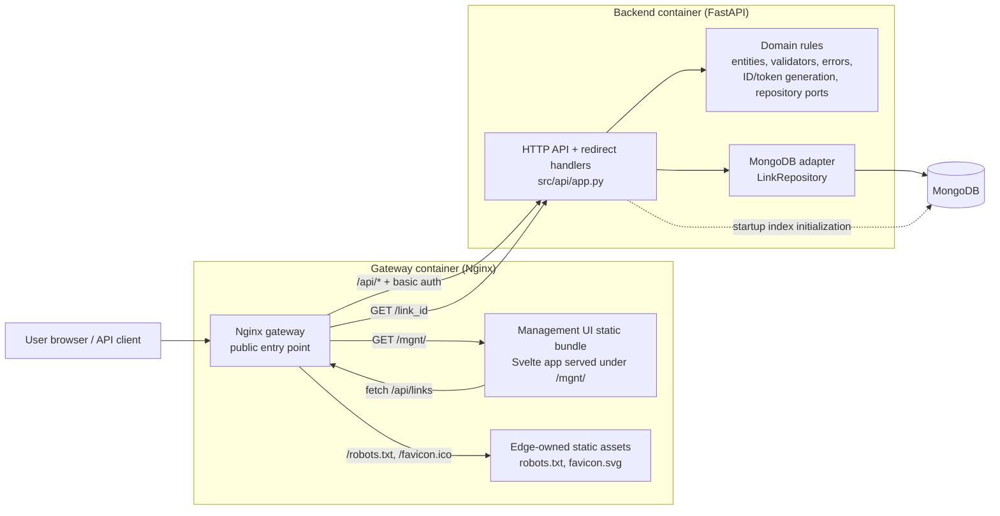

# TinyURL application architecture

This diagram describes the current MVP runtime architecture in this repository. It reflects the implemented Docker Compose stack and the backend's layered structure.

## Component responsibilities

- **Nginx gateway** is the mandatory public entry point. It terminates the external HTTP surface, enforces basic auth for `/mgnt` and `/api`, serves the built management UI, serves edge-owned static assets, and forwards public redirect traffic plus authenticated API traffic to the backend.
- **Management UI** is a Svelte application compiled into static assets and embedded into the gateway image. It uses browser `fetch` calls to the authenticated `/api` surface for create, update, delete, and lookup flows.
- **FastAPI backend** handles both authenticated management endpoints and public redirect resolution. The current MVP keeps read and write operations in the same service process.
- **Domain layer** contains the core business rules: URL and alias validation, redirect-code validation, edit-token hashing/verification, link-ID generation, and domain-level error contracts.
- **MongoDB adapter** persists and retrieves link documents, including alias changes and soft deletion/tombstoning behavior.
- **MongoDB** is the system of record for shortened links.

## Notes

- The requirements document includes a future logical read/write split with an in-memory or Redis cache for high-throughput redirects. That cache is **not implemented in the current repository**, so the diagram above shows the architecture as it exists today.
- The Docker build also folds the frontend build output into the gateway image, which keeps the public entry point and management UI deployment together.
