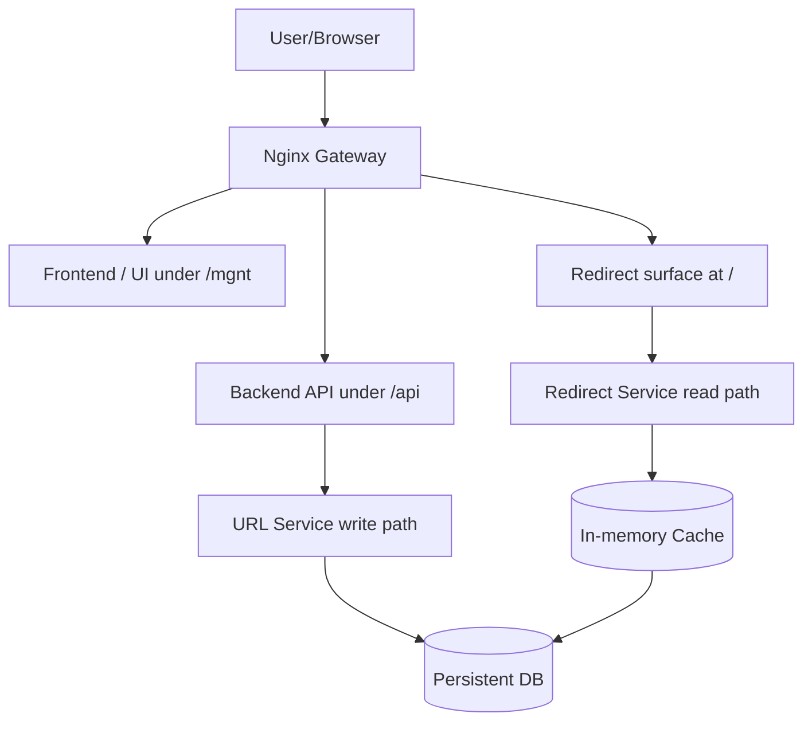

# TinyURL requirements

Here is a set of functional and non-functional requirements for a TinyURL-type application (URL shortener).

---

## Functional requirements

### Adding a new link

1. An authenticated management user can submit an original URL to shorten through the `/mgnt` management UI, which calls the authenticated backend API under `/api`, with both surfaces protected by Nginx basic auth.
2. If no `link-id` is provided, the system generates one as 6 hexadecimal characters `[0-9a-f]` (lowercase).
   - The system must ensure uniqueness atomically; on collision, retry generation (up to 5 attempts, then 500).
3. The user may optionally provide a custom `link-id` (e.g., `my-link`) subject to:
   - Allowed charset: `^[A-Za-z0-9_-]{1,32}$`
   - Normalization: lowercase
   - Not in reserved list: `api`, `admin`, `mgnt`, `robots`, `favicon`, `health`, `metrics`, `static`, etc.
4. The user can optionally choose the redirect status code (allowed: 301, 302, 307, 308). Default: 301.
5. The system returns:
   - The shortened URL: `https://tinyurl.domain.com/<link-id>`
   - A high-entropy edit token (see Security) for future edits/deletion.
6. URL validation:
   - Scheme: `http://` or `https://`
   - Max length: 2048 chars
   - Punycode normalization for internationalized domains
   - Disallow private-link schemes (e.g., `file:`, `javascript:`).

### Updating an existing link

1. The user can update:
   - The `target_url`
   - The `redirect_code`
   - Or the `link-id` (alias change)
2. Updates require providing valid `edit_token` and access to the authenticated management surfaces (`/mgnt` UI and `/api` API).
3. If changing the `link-id`, the new ID must be unused. By default, the old ID stops working and will return 410 Gone (see Deletion).

### Deleting an existing link

1. An authenticated management user can request deletion of a previously created link using a valid `edit_token`.
2. The system marks the entry as deleted (`active=false`, `target_url` may be nulled). Redirect service must return 410 Gone for that `link-id`.

### Redirection

1. Visiting `https://tinyurl.domain.com/<link-id>` with `GET` returns a redirect to the original URL with the configured code (301, 302, 307, or 308).
2. For a deleted `link-id`, return 410 Gone. For non-existent IDs, return 404.
3. The public root redirect surface accepts only `GET` requests. URL-management activity must not be exposed on the root path.
4. Caching:
    - 301/308 may include long max-age (configurable).
    - 302/307 should be non-cacheable by default.

## Non-functional requirements

### Performance

1. Handle 1000 redirect requests per second; 95% processed within 100ms, 99% within 300ms (cache hit).
2. O(1) `link-id` → URL lookup via in-memory/Redis cache backed by a persistent store.

### Scalability

1. Enable horizontal scaling.
2. Separate write path (create/update/delete) from read path (redirects).
3. Eventual consistency from write to cache is acceptable (<5s).

### Security

1. URL-management activity is exposed only through the authenticated management UI under `/mgnt` and the authenticated backend API under `/api`, both protected by Nginx-based HTTP basic authentication.
2. Each created link returns an edit token:
    - 24-character random string from `[A-Za-z0-9]` (≈143 bits entropy).
    - Store only a SHA-256 hash (optionally with a server-side pepper); never store plaintext.
    - Optionally rotate token on successful update.
3. Nginx is the mandatory public entrypoint. The management UI is served under `/mgnt` and the backend API/docs under `/api` through Nginx; redirects are served from the root path.
4. UI/API available only over HTTPS. Redirects may be served over HTTP and HTTPS (configurable).
5. CSRF protection on form endpoints; CORS configured if exposing APIs to browsers.
6. Basic-auth credentials must be supplied via deployment configuration and must not be committed to the repository.
7. Abuse controls: domain blocklist and optional safe-browsing checks.
8. Input validation and output encoding in UI to prevent XSS.
9. Gateway hardening:
    - Nginx must reject clearly malicious exploit probes at the edge, including obvious injection payloads, path traversal probes, access to sensitive runtime paths, and known low-value abusive user agents.
    - Nginx must deny access to hidden files and sensitive metadata artifacts such as dotfiles, backup files, and misplaced configuration files in the web root.
    - Nginx must disable unnecessary information disclosure such as server version tokens.
    - Nginx must apply conservative request handling defaults suitable for a small form-based application, including request body sizing and client timeout limits.
    - Nginx hardening rules must be stored in version control and applied consistently across environments.
10. Security headers:
    - The gateway must send baseline security headers for UI and static responses, including at least protections against MIME sniffing, clickjacking, and overly broad referrer leakage.
    - A restrictive Content Security Policy and Permissions Policy should be configured for the management UI, subject to application compatibility.
11. Access control and verification:
    - Non-public routes must follow deny-by-default access control principles.
    - Security-sensitive gateway behavior must be covered by automated validation or deployment smoke checks.
12. Error handling and exposure:
    - Unauthenticated clients must not receive stack traces, infrastructure metadata, or other unnecessary implementation details in error responses.
13. Configuration integrity:
    - Gateway and deployment security configuration changes must go through code review and use trusted, version-controlled build assets.

### SEO and redirects

1. Support for 301, 302, 307, and 308:
   - 301 Moved Permanently: cacheable by default; search engines transfer ranking.
   - 302 Found: temporary; not cacheable by default; method may change on some clients.
   - 307 Temporary Redirect: temporary; method preserved.
   - 308 Permanent Redirect: permanent; method preserved; cacheable by default.
2. Serve a static `robots.txt` (configurable) from Nginx.
3. Serve other edge-owned static assets such as `favicon.ico` from Nginx rather than the application backend.

### Error handling

- 400 Invalid input (e.g., bad URL, bad `link-id` format)
- 401/403 Invalid or missing edit token
- 404 Not found
- 409 Conflict (custom `link-id` already taken)
- 410 Gone (deleted link)
- 500/503 Server errors

## Data model

Example JSON document representing one entry:

```json
{
  "link_id": "aZ8kL2",
  "target_url": "https://example.com/abc/xyz",
  "redirect_code": 302,
  "created_at": "2025-06-29T14:35:00Z",
  "updated_at": "2025-06-29T14:35:00Z",
  "edit_token_hash": "sha256-hash-of-edit-token",
  "active": true,
  "expires_at": null
}
```

## Logical architecture (Mermaid)



### Components

- Nginx Gateway: Mandatory public entry point; basic auth for `/mgnt` and `/api`; serves edge-owned static files; proxies management and redirect traffic.
- Frontend / UI: Authenticated management interface served under `/mgnt`.
- Backend API: Validates and processes authenticated management traffic under `/api`.
- URL Service: ID generation; writes/updates/deletes; cache invalidation.
- Redirect Service: High-performance lookups for public root-path redirects.
- Cache: In-memory/Redis for hot lookups.
- DB: Persistent store (MongoDB).

## Technology suggestions

- Frontend: Svelte, Vue, or Preact
- API/Backend: Python (FastAPI)
- API Gateway: Nginx (required public entrypoint)
- Cache: Redis
- Database: MongoDB
